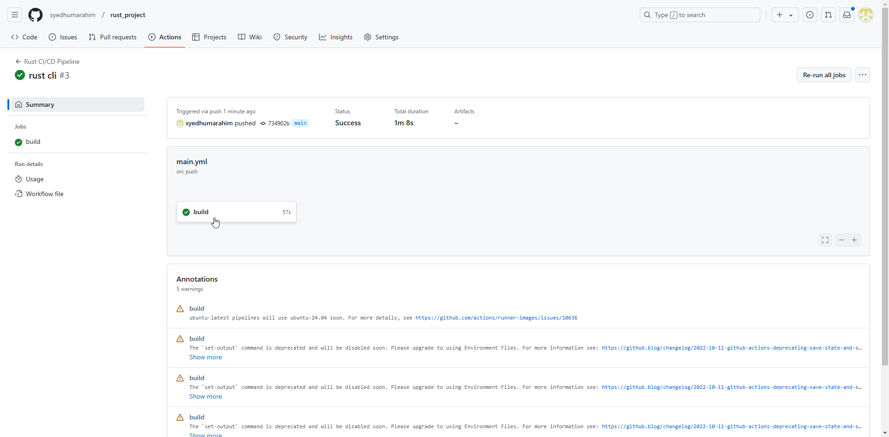

[](https://github.com/syedhumarahim/rust_project/actions/workflows/main.yml)

# Rust CLI Binary with SQLite

This is the Assignment for Data Engineering on building a rust based CLI interacting with a SQL Database.

# Overview 

This project demonstrates a Rust-based command-line interface (CLI) application integrated with an SQLite database. It perform basic CRUD (Create, Read, Update, Delete) operations on a SQLite database using a Python application. The dataset used contains medical records with fields such as patient ID, name, date of birth, gender, medical conditions, medications, allergies, and last appointment date. Additionally, this project showcases an optimized Rust binary generated through GitLab CI, with automated testing, building, and linting processes. Throughout the development, a Large Language Model (LLM) was utilized to enhance coding efficiency and support Rust's syntax understanding.

# Structure

```
├── .devcontainer/
│   ├── devcontainer.json
│   └── Dockerfile
├── .github/
│   └── workflows/main.yml
├── .gitignore
├── data/
│   └── medical_records.csv
├── Makefile
├── src/
│   ├── lib.rs
│   ├── main.rs
├── Cargo.toml
├── README.md
└── medical_records_DB.db
```

## 2. **CRUD Operations**
We demonstrate the following CRUD operations:
- **Create:** Insert new records into a table.
- **Read:** Query and retrieve records from the table.
- **Update:** Modify existing records within the table.
- **Delete:** Remove records from the table.

### Set up and Running Rust

#### First, compile the Rust project by running:
```
cargo build
```

#### Now we can Run the project by:
- Extract Data: To run the data extraction process, execute:
```
cargo run extract
```
- Load Data: To load the extracted data into the SQLite database, run:
```
cargo run load
```
Query Data: To query the data, use the following command. Replace [query] with your SQL query:
```
cargo run query "[query]"
```
These commands will allow you to extract, load, and query data within the SQLite database using the CLI.


## Use of LLMs

LLMs like GitHub Copilot were instrumental in understanding Rust syntax and best practices, as well as generating boilerplate code efficiently. They also provided valuable suggestions for writing documentation, resolving errors and debugging issues encountered during development. This improved both the coding speed and the quality of the project.

The following was writen using LLM:

Dependencies and Installation:
The project depends on reqwest, rusqlite, and csv crates. Install them using cargo by running:

```cargo build```

Project Explanation:

This Rust CLI application performs CRUD operations on a SQLite database using a sample dataset. It showcases data extraction, loading, and query execution, enabling users to interact with the database via command-line arguments.

How to Run the Program:

Build the project:

```cargo build```

Execute actions like extract, load, and query using:

```cargo run <action> [optional SQL query]```

Example:

```
cargo run extract  
cargo run load  
cargo run query "SELECT * FROM PatientData;
```

## Database Table: `medical_records`

The SQLite database contains a single table called `medical_records`, which stores the details of patients' medical records. Below is the structure of the table along with explanations for each field.

### Table Structure:

| Column Name              | Data Type | Description                                                |
|--------------------------|-----------|------------------------------------------------------------|
| `patient_id`              | INTEGER   | A unique identifier for each patient.                      |
| `name`                    | TEXT      | The full name of the patient.                              |
| `date_of_birth`           | TEXT      | The patient's date of birth in `YYYY-MM-DD` format.        |
| `gender`                  | TEXT      | The gender of the patient (`M` for Male, `F` for Female).   |
| `medical_conditions`      | TEXT      | A comma-separated list of the patient's medical conditions. |
| `medications`             | TEXT      | A comma-separated list of medications the patient is taking.|
| `allergies`               | TEXT      | A comma-separated list of the patient's known allergies.    |
| `last_appointment_date`   | TEXT      | The date of the patient's most recent appointment.          |

### Example Record:

| `patient_id` | `name`         | `date_of_birth` | `gender` | `medical_conditions`          | `medications`         | `allergies`        | `last_appointment_date` |
|--------------|----------------|-----------------|----------|-------------------------------|-----------------------|--------------------|-------------------------|
| 1            | Scott Webb     | 1967-04-28      | F        | Mrs, story, security           | example, parent, city  | each, product, two | 2022-07-26              |

### Field Descriptions:

- **`patient_id`**: This is a unique identifier for each patient in the database. It is an `INTEGER` value and serves as the primary key for the table.
  
- **`name`**: The full name of the patient stored as a `TEXT` value.

- **`date_of_birth`**: The patient's date of birth, formatted as `YYYY-MM-DD`. It is a `TEXT` value to accommodate different date formats.

- **`gender`**: The gender of the patient, stored as `TEXT`. Typically, the values will be either 'M' (Male) or 'F' (Female).

- **`medical_conditions`**: A comma-separated list of medical conditions the patient has. It is a `TEXT` value, allowing the system to store multiple conditions in one field.

- **`medications`**: A comma-separated list of medications the patient is taking, stored as `TEXT`.

- **`allergies`**: A comma-separated list of known allergies, stored as `TEXT`.

- **`last_appointment_date`**: The date of the patient's most recent appointment, formatted as `YYYY-MM-DD`, stored as `TEXT`.

### Example Queries:
You can run the following SQL queries to interact with the `medical_records` table:

- **fetching patients with asthma**:

  ```SELECT * FROM medical_records WHERE medical_conditions LIKE '%asthma%';```


# CI/CD Pipeline with GitHub Actions



To maintain code quality and streamline development, I have set up a CI/CD pipeline using GitHub Actions. Here's how it enhances the project:

### Automated Testing
Every push triggers tests using `cargo test`, ensuring new changes don't break existing functionality.

### Code Formatting and Linting
`cargo fmt` formats the code consistently.  
`cargo clippy` lints the code to catch errors and enforce coding standards.

### Dependency Management
Dependencies are managed via the `Cargo.toml` file, ensuring a consistent and reproducible build environment.

### Continuous Integration Badges
The README includes badges that display the status of the pipeline steps, providing immediate feedback on the codebase's health.

This automated workflow not only saves time but also ensures that the project remains robust, maintainable, and scalable.

## Youtube Video

[click here](https://youtu.be/8h8eAjYuRyk)

